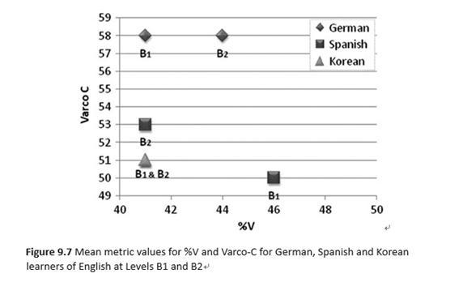
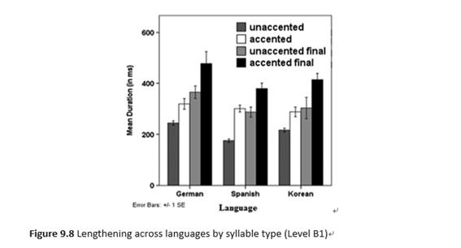
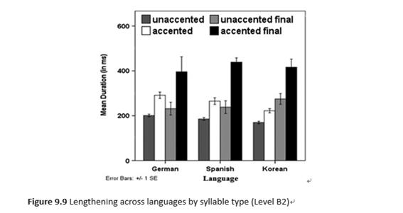

# Lesson 9. Assessing seecond language prounication : Distinguishing Feature of Rhythm in learner speech at different proficiency levels #

## Study 2: Differences across first Languages ##

- Figure 9.7 plots the proportion of vocalic material (%V) produced by the German, Spanish, and Korean learners against the variability in their consonantal intervals (Varco-C)

- The data in the figure show that the rhythm metrics differ for the three L1 learner groups, with the highest Varco-C values for German and the highest %V values for spanish, as would be expected under L1 transfer - that is, a high number of consonants and low number of vowels in German a stress-timed language and vice versa in Spanish as a syllable-times language. 

- The effect of L1 background on accentual and phrase-final lengthening for Levels B1 and B2, respectively. 

- German learners better at distinguishing between the prosodic lengthening of accented and unaccented final syllables than the other learners, at least at Level B1. 

- At the level B2,with German learners differentiating less between the different syllable types, while the Koreans are doing better, and the spanish are essentially continuing as before.
- Although German learners with the most typologically similar language background to the target language showed an early advantage for some measures, they were often still as far off as the other L1 groups at the intermediate B levels 

- An ANOVA with fixed factors L1 language (German, Sapnish, and Korean), Level (B1 and B2), and Lengthening condition (unaccented, accented, unaccented final, accented final) showed significant main effects for all three factors respectively. 

- A significant interaction between language and Level, F(2,1683)=3.22, p<0.05, confirming the pattern of results. 

** We can conclude that the measures tested here can successfully distinguish between the spoken productions of learners from different L1 backgrounds. **

### Discussion ### 
- This investigation has shown that some of the prosodic measures under investigation here can provide useful micro-level prosodic measures for consideration L2 teaching and assessment contexts. 
The higher level learners in the sample used here were found to

1. have a higher speech rate, and produce more frequent and shorter syllables as reflected in the speech rate measurements, likely as a result of higher automaticity of  speech planning and execution processes. (Field, 2011)

2. differ durationally between unaccented/accented and  non-final/final syllabuses, indicating that at higher levels of proficiency learners are likely to have implemented different prosodic categories for different syllables types and display these with appropriate durational patterns

3. Increased mastery of language-specific properties like vowel reduction and syllable structure complexity, and also accentual and final lengthening. 

- The results of Study 2 indicated that learners with different language backgrounds show different prosodic patterns. 

1. Learners from a stress-timed language such as German showed the highest ability to deal with consonantal variation and learners from a syllable timed language such as Spanish displayed the highest proportion of vocalic material, suggesting that transfer effects that can be predicted on the basis of the rhythmic properties of their respective L1s still take effect at the B levels

2. German learners were better at distinguishing the durations between different syllable types than the Korean and Spanish leaners at B1, but the Korean learners showed a clear progression at B2. 

